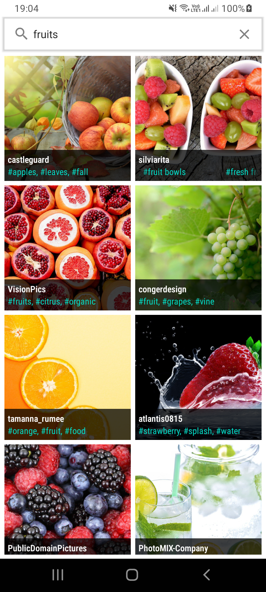
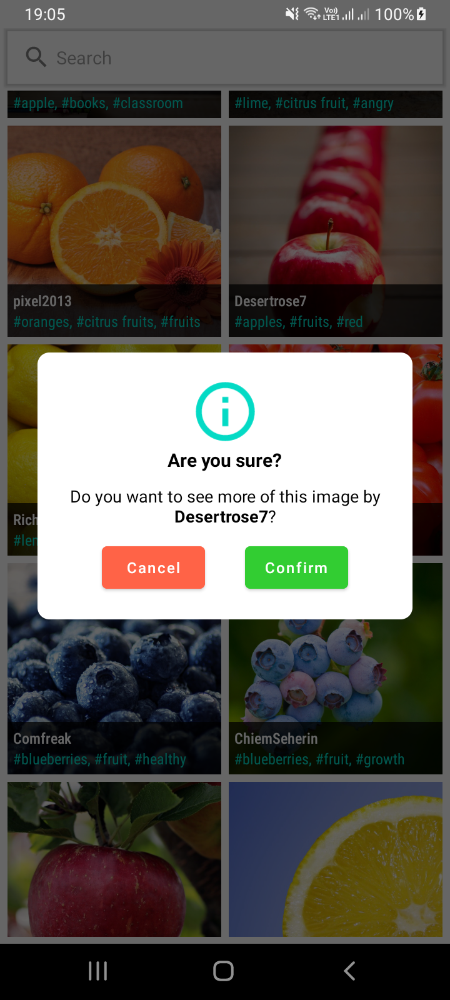
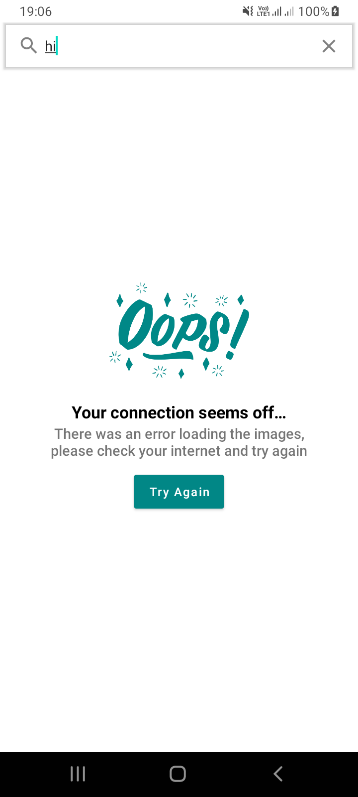
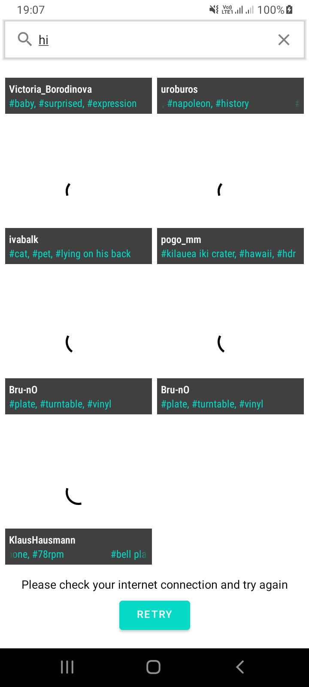
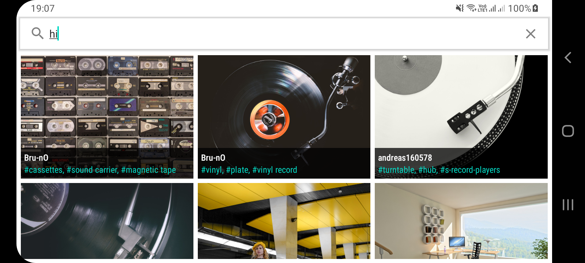

# Images

An Android app consuming Pixabay API to search and display list of images, built with MVVM pattern as well as Architecture Components. 

Min Api Level: 23

Build System : [Gradle](https://gradle.org/)

## Table of Contents

- [Prerequisite](#prerequisite)
- [App](#app)
- [Architecture](#architecture)
- [Testing](#testing)
- [Libraries](#libraries)
- [Demo](#demo)

## Prerequisite

This project uses the Gradle build system. To build this project, use the
`gradlew build` command or use "Import Project" in Android Studio. 

## App

The app loads the the images from the api based on search query and displays them in a list. It also has Room DB for local cache.
When the Image is clicked, a dialog is shown and upon positive user input the app navigates to the Details fragment which shows a bigger picture.

## Architecture

The app is built using the Modular MVVM architectural pattern and makes heavy use of a couple of Android Jetpack components. MVVM allows for the separation of concern which also makes testing easier. The app has a fragment that communicates to ViewModel which in turn communicates to the usecase which communiacates to Repository to get data. 

||
|:----:|

## Testing

With MVVM testing is made easier in that Ui can be tested separately from the business logic. Mocking the ViewModel to test the fragment for user interaction using espresso, mocking the repository to test the ViewModel with Junit as well as mocking the API service/dao to test the repository using the Junit. The App has tests on Fragments as well as Paging test under the Android Test packages in respective modules.
 
## Libraries

Libraries used in the whole application are:

- [Jetpack](https://developer.android.com/jetpack)🚀
  - [Viewmodel](https://developer.android.com/topic/libraries/architecture/viewmodel) - Manage UI related data in a lifecycle conscious way
  - [Data Binding](https://developer.android.com/topic/libraries/data-binding) - support library that allows binding of UI components in  layouts to data sources, binds character details and search results to UI
  - [Room](https://developer.android.com/training/data-storage/room) - Provides abstraction layer over SQLite
- [Retrofit](https://square.github.io/retrofit/) - Type-safe HTTP client and supports coroutines out of the box.  Used for the network calls.
- [Gson](https://github.com/google/gson) - Used to convert JSON to Java/Kotlin classes for the Retrofit
- [okhttp-logging-interceptor](https://github.com/square/okhttp/blob/master/okhttp-logging-interceptor/README.md) - logs HTTP request and response data.
- [kotlinx.coroutines](https://github.com/Kotlin/kotlinx.coroutines) - Library Support for coroutines
-  [Hilt](https://developer.android.com/training/dependency-injection/hilt-android) - Used for Dependency injection
- [Glide](https://github.com/bumptech/glide) - Allows for fetching and displaying of images to imageviews

## Screenshots

||||
|:----:|:----:|:----:|

||||
|:----:|:----:|:----:|

|||
|:----:|:----:|
